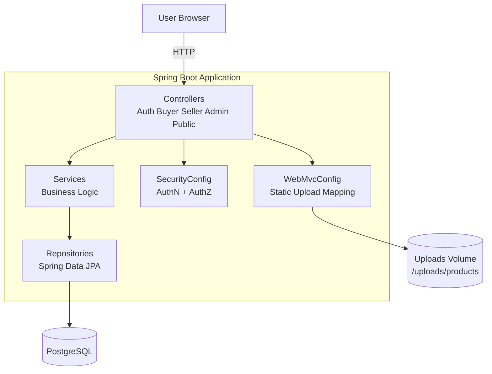
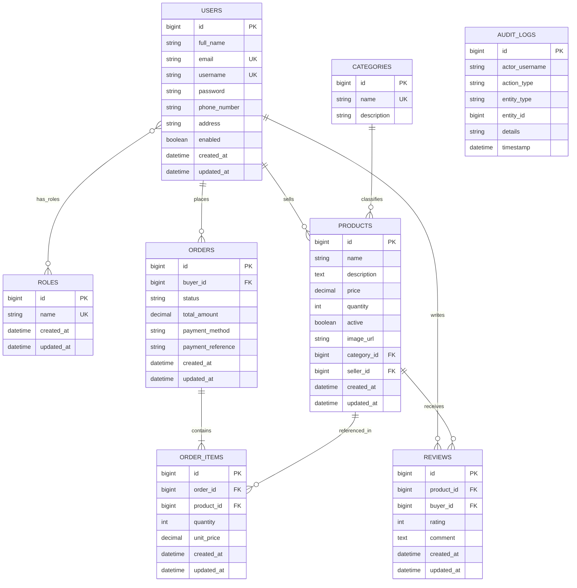

# HaatBazar (Mini Market Place)

HaatBazar is a role-based multi-vendor marketplace web application built with Spring Boot and Thymeleaf. It supports buyer, seller, and admin workflows including catalog browsing, order lifecycle management, review moderation, user management, and audit logging.

## Project Description

The application is designed as a traditional server-rendered marketplace platform:

- Buyers can browse products, filter/search listings, place orders, track/cancel orders, and submit reviews.
- Sellers can manage their profiles, create/update/delete products, and advance order statuses.
- Admins can manage users, products, orders, and reviews, and inspect audit trails.

Core features:

- Authentication and authorization with Spring Security (form login, remember-me, role checks).
- Product catalog with search, pagination, sorting, category filtering, and pricing filters.
- Order and payment flow (simulated payment reference generation).
- Review system with one-review-per-buyer-per-product constraint.
- Audit logging for critical business and administrative actions.
- Dockerized runtime with PostgreSQL and persisted upload volume.

## Tech Stack

- Java 17
- Spring Boot 3.3.5
- Spring MVC + Thymeleaf
- Spring Security
- Spring Data JPA (Hibernate)
- PostgreSQL (runtime), H2 (test scope)
- Maven Wrapper
- Docker + Docker Compose
- GitHub Actions CI pipeline

## High-Level Architecture



## Package Structure

- src/main/java/com/example/mini_marketplace/controller: MVC controllers and route handlers
- src/main/java/com/example/mini_marketplace/service: business use cases
- src/main/java/com/example/mini_marketplace/repository: JPA repositories
- src/main/java/com/example/mini_marketplace/entity: domain model / persistence entities
- src/main/java/com/example/mini_marketplace/config: security, seeding, MVC resource config
- src/main/resources/templates: Thymeleaf pages
- src/main/resources/static: CSS/JS/assets

## ER Diagram



Notes:

- REVIEWS has a unique constraint on (product_id, buyer_id) to enforce one review per buyer per product.
- AUDIT_LOGS stores actor and action metadata for administrative traceability.

## API Endpoints (MVC Routes)

These routes are server-rendered endpoints (Thymeleaf views and form posts), not a pure JSON REST API.

### Public & Auth

| Method | Path | Description | Access |
|---|---|---|---|
| GET | / | Entrance page | Public |
| GET | /products | Public product catalog with filters | Public |
| GET | /products/{id} | Public product details | Public |
| GET | /auth/login | Login page | Public |
| GET | /auth/register | Registration page | Public |
| POST | /auth/register | Register a new user | Public |

### Buyer

Base path: /buyer

| Method | Path | Description | Access |
|---|---|---|---|
| GET | /profile | View buyer profile | BUYER |
| POST | /profile | Update buyer profile | BUYER |
| POST | /profile/delete | Delete own buyer account | BUYER |
| GET | /products | Buyer product listing with filters | BUYER, ADMIN |
| GET | /products/{id} | Buyer product detail + review state | BUYER, ADMIN |
| GET | /checkout | Checkout page | BUYER, ADMIN |
| POST | /checkout/pay | Place order / process payment | BUYER, ADMIN |
| GET | /payment-success | Payment success page | BUYER, ADMIN |
| GET | /orders | List buyer orders | BUYER, ADMIN |
| POST | /orders/{id}/cancel | Cancel own order (business rules apply) | BUYER, ADMIN |
| POST | /products/{id}/review | Create review | BUYER, ADMIN |
| POST | /reviews/{reviewId}/edit | Edit review | BUYER, ADMIN |
| POST | /reviews/{reviewId}/delete | Delete review | BUYER, ADMIN |

### Seller

Base path: /seller

| Method | Path | Description | Access |
|---|---|---|---|
| GET | /dashboard | Seller dashboard metrics | SELLER, ADMIN |
| GET | /profile | Seller profile page | SELLER |
| POST | /profile | Update seller profile | SELLER |
| POST | /profile/delete | Deactivate/delete own seller account | SELLER |
| GET | /products | List seller products | SELLER, ADMIN |
| GET | /products/add | Product create form | SELLER, ADMIN |
| POST | /products/add | Create product | SELLER, ADMIN |
| GET | /products/edit/{id} | Product edit form | SELLER, ADMIN |
| POST | /products/edit/{id} | Update product | SELLER, ADMIN |
| POST | /products/delete/{id} | Delete product | SELLER, ADMIN |
| GET | /orders | List seller orders | SELLER, ADMIN |
| POST | /orders/{id}/advance | Advance order status | SELLER, ADMIN |
| GET | /reviews | List reviews on seller products | SELLER, ADMIN |

### Admin

Base path: /admin

| Method | Path | Description | Access |
|---|---|---|---|
| GET | /dashboard | Admin metrics dashboard | ADMIN |
| GET | /users | User management list | ADMIN |
| POST | /users/{id}/delete | Delete user | ADMIN |
| POST | /users/{id}/toggle-enabled | Enable/disable user | ADMIN |
| POST | /users/{id}/change-role | Change user role | ADMIN |
| GET | /products | Product moderation list | ADMIN |
| POST | /products/{id}/delete | Delete product (admin) | ADMIN |
| GET | /orders | Order management list | ADMIN |
| POST | /orders/{id}/status | Override order status | ADMIN |
| GET | /audit | Paginated audit logs | ADMIN |
| GET | /reviews | Review moderation list | ADMIN |
| POST | /reviews/{id}/delete | Delete review (admin) | ADMIN |

### Other

| Method | Path | Description | Access |
|---|---|---|---|
| GET | /seller/profile/{sellerId} | Public seller profile page | Authenticated |
| GET | /dashboard | Buyer dashboard page | Authenticated |

## Security Model

- Public: /, /auth/**, /products/**, static assets, upload resources.
- Admin-only: /admin/**.
- Seller domain: /seller/** requires ADMIN or SELLER.
- Buyer domain: /buyer/** requires ADMIN or BUYER.
- Seller public profile route (/seller/profile/**) requires authentication.
- Post-login redirect by role:
  - ADMIN -> /admin/dashboard
  - SELLER -> /seller/dashboard (or /seller/profile if disabled)
  - BUYER -> /buyer/products

## Environment Variables

The application supports environment-based configuration:

| Variable | Default | Purpose |
|---|---|---|
| PORT | 8081 | Application HTTP port |
| SPRING_DATASOURCE_URL | jdbc:postgresql://localhost:5432/marketplace_db | PostgreSQL JDBC URL |
| SPRING_DATASOURCE_USERNAME | postgres | DB username |
| SPRING_DATASOURCE_PASSWORD | postgres | DB password |
| SPRING_JPA_HIBERNATE_DDL_AUTO | update | Schema strategy |
| APP_UPLOAD_DIR | uploads/products | Product image upload directory |

## Run Instructions

### Prerequisites

- Java 17
- Maven (or use Maven Wrapper included in repo)
- PostgreSQL 16+ (for local run)
- Docker + Docker Compose (for containerized run)

### Option 1: Run Locally (without Docker)

1. Create a PostgreSQL database named marketplace_db.
2. Set credentials using environment variables or update src/main/resources/application.properties.
3. Run the app:

```bash
./mvnw spring-boot:run
```

On Windows PowerShell:

```powershell
.\mvnw.cmd spring-boot:run
```

Application URL: http://localhost:8081

### Option 2: Run with Docker Compose

This starts PostgreSQL and the Spring Boot app together.

```bash
docker compose up --build
```

Application URL: http://localhost:8081

Notes:

- Uploaded images persist via uploads_data volume.
- PostgreSQL data persists via postgres_data volume.

### Build Jar

```bash
./mvnw clean package
```

Produced artifact:

- target/HaatBazar-0.0.1-SNAPSHOT.jar

## Default Seed Data

At startup, DataInitializer seeds:

- Roles: ROLE_ADMIN, ROLE_SELLER, ROLE_BUYER
- Default admin account:
  - Username: admin
  - Password: admin123
- Default categories and demo seller/product data (if product table is empty)

## CI/CD Explanation

GitHub Actions workflow file: .github/workflows/ci.yml

### Current Pipeline Stages

1. Test job
- Runs on push/PR to main/master
- Executes ./mvnw test
- Uploads Surefire reports as artifacts

2. Code Quality job (after tests)
- Compiles code: ./mvnw compile -q
- Runs dependency analysis: ./mvnw dependency:analyze -DfailOnWarning=false -q

3. Build job (after tests + quality)
- Packages JAR with tests skipped: ./mvnw package -DskipTests
- Uploads built JAR artifact

4. Docker validation job (after build)
- Builds app JAR (quiet mode)
- Builds Docker image tagged with commit SHA

5. Final gate
- all-checks job signals successful completion when dependencies pass

### What is CI vs CD here?

- CI is fully implemented: test, compile validation, package, and Docker image build checks.
- CD is partial: the workflow validates build artifacts but does not currently push images to a registry or deploy to an environment.

To extend to full CD, add steps for:

- Container registry login and image push (GHCR or Docker Hub)
- Deployment to target infrastructure (VM, Kubernetes, ECS, etc.)
- Post-deploy smoke tests and rollback strategy

## Testing

Run all tests:

```bash
./mvnw test
```

Run a specific test class:

```bash
./mvnw -Dtest=BuyerServiceTest test
```

## Roadmap Ideas

- Add OpenAPI/Swagger for machine-readable API docs.
- Add email verification and password reset flow.
- Add payment gateway integration beyond simulated references.
- Add production-grade observability (metrics, tracing, structured logs).
- Add deployment workflow to complete CD automation.
